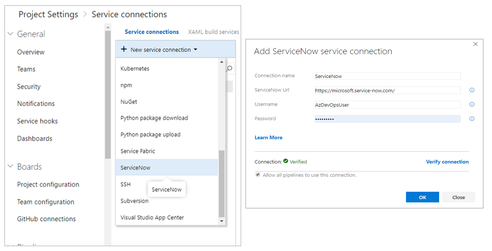
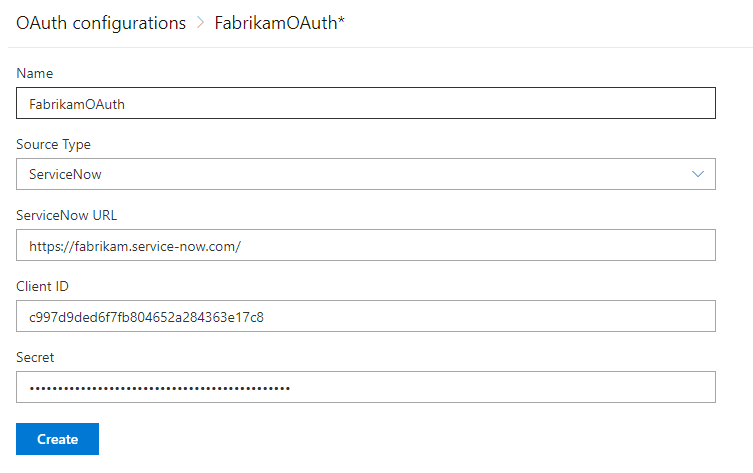
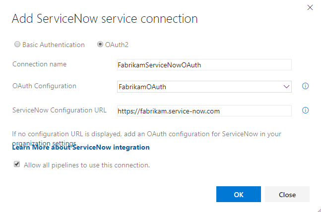
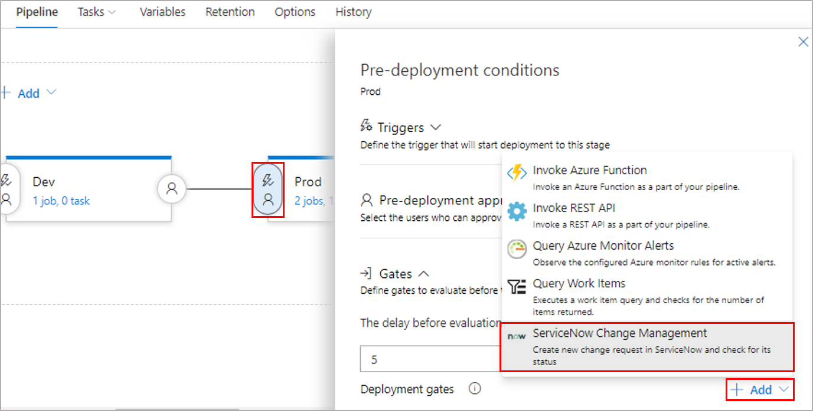
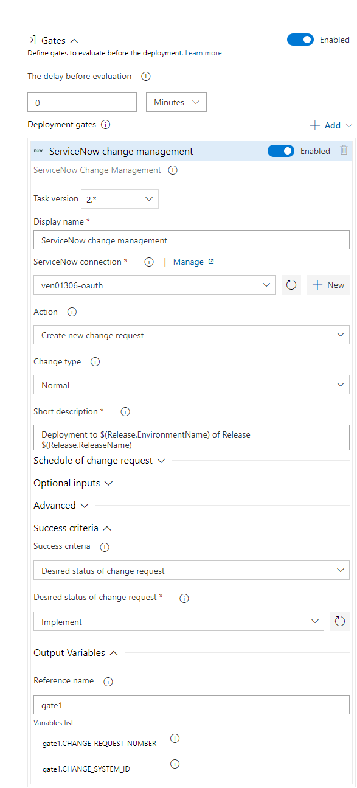
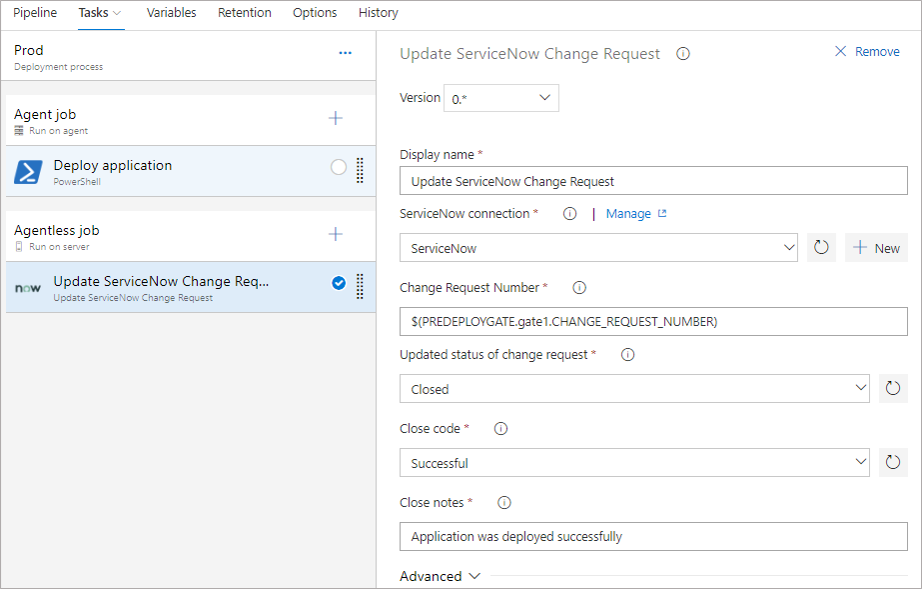

# Developer ServiceNow CHG Release Gate

MSFT [extension](https://docs.microsoft.com/en-us/azure/devops/pipelines/release/approvals/servicenow?view=azure-devops) is great and use best practices:

- There is special ServiceNow side application which handle incoming requests
- It uses security best practices of least privilege to have separate role with limited permissions to access ServiceNow
- It uses performance best practices - special custom staging table created where incoming changes are put before being promoted to production table

But this makes impossible to use developer ServiceNow instances as it is impossible to install applications there.

There is a way to overcome this requirement (application installation on ServiceNow instance from ServiceNow MarketPlace) by using modified extension which directly hit change request table over ServiceNow REST API, so this will work even on developer ServiceNow instances.

MSFT extension is open source (MIT license) and available here: [GitHub repo](https://github.com/microsoft/azure-pipelines-extensions/tree/master/Extensions/ServiceNow/Src)

This custom extension is based on MSFT one. Source code is here: [GitHub repo](https://github.com/albert-salman/az-devops-now)

If best practices mentioned above are not critical then with caution this extension can be used on non-developer instances upon getting approval on reduced performance and security.

> This extension works only with Azure DevOps Services and Azure DevOps Server 2019 Update 1 onwards..

It includes 
- A [release gate](https://docs.microsoft.com/en-us/azure/devops/pipelines/release/approvals/gates?view=vsts) to hold the pipeline till the change management process signals implementation for a change request. You can create a new change request for every deployment or use an existing change request.                     
- An agentless task to update a change request during the deployment process. It is typically used as the last task in the stage.

The deployment process in Azure Pipelines helps automate the deployment and complement the controls offered by ServiceNow.

## Usage

### Build and publish

You will need to update the publisher, author and GUID for each task in this repo if you want to publish your own copy.

To package the extension, then run the following command:

```cli
yarn install
yarn run package
```

You can now upload the extension using `tfx extension publish` or via the [manage publisher portal](https://marketplace.visualstudio.com/manage/publishers/) (no special requirements to create own publisher - just register/sign-in).

### **Create users and accounts in ServiceNow**

For the two services to communicate, a service/user account in ServiceNow must be granted the `rest_service` and `change_manager` roles. Create or edit a user in ServiceNow for this purpose.

In case you wish to use OAuth for communication between services, Azure DevOps should be registered in ServiceNow as an OAuth app. [Learn more](#How-to-register-Azure-DevOps-in-ServiceNow-as-an-OAuth-App).

### **Create service connection for ServiceNow in Azure Pipelines**

Service connection in Azure DevOps store the connection details for external services. The connection details are securely passed to tasks and gates during execution, enabling communication with the services.
ServiceNow service connection supports two authentication types - Basic authentication and OAuth2. [Learn more](https://docs.microsoft.com/en-us/azure/devops/extend/develop/auth-schemes?view=azure-devops) about authentication schemes.

 #### Basic authentication

 This needs a service account (user) to be created in ServiceNow.
 Provide username and password for the service account configured for basic auth.

> Use **Verify connection** before using it in the gate or task. 



#### OAuth2 authentication

In addition to granting role to a user in ServiceNow, Azure DevOps should be registered in ServiceNow as an OAuth app. 
##### Register your OAuth configuration in Azure DevOps Services
1. Sign into Azure DevOps Services.
2. Add OAuth configuration from  **Organization settings>Oauth configurations**


3. Create an OAuth configurion using the OAuth application details obtained while registering Azure DevOps as an OAuth app in ServiceNow. 



##### Create OAuth service connection for ServiceNow

 Use the OAuth configuration created above and provide the ServiceNow instance Url.
 
 

### **Configure a release gate for ServiceNow Change Management**




**Gate** can be configured to **create a new change request** for every run of the pipeline or **use an existing request**.
Inputs provided in the gate are used as properties for the new change request in ServiceNow, if applicable.

 **Inputs for Gate**:

- **ServiceNow connection**: Connection to the ServiceNow instance used for change management.
- **Action**: Gate on status of new change request or an existing change request.
- **Change type**: Type of the change request.
- **Standard change template**: Change template name for the change request.
- **Short description**: A summary of the change.
- **Change query criteria**: Criteria for querying change request. Must uniquely identify the change request. Gate would fail if multiple matching change requests are found.
- **Query string/Change request number**: Change request to use.

Additional properties can be set in the created change request using the following inputs. 
**Note**: Available inputs change based on the selected change type.

- **Description**: A detailed description of the change.
- **Category**:  The category of the change eg. Hardware, Network, Software.
- **Priority**: Priority of the change.
- **Risk**: The risk level for the change.
- **Impact**: The effect that the change has on business.
- **Configuration Item**: Configuration item (CI) that the change applies to.
- **Assignment group**:  The group that the change is assigned to.
- **Schedule of change request**: Schedule of the change as honored by the ServiceNow workflow. Date and time should be in UTC and format should be `yyyy-MM-ddTHH:mm:ssZ. eg. 2018-01-31T07:56:59Z.`
- **Additional change request parameters**:  Additional properties of the change request to set.                                                                                      Name must be field name (not label) prefixed with 'u_' `eg. backout_plan`.                                                            Value must be a valid, accepted value in ServiceNow. Invalid entries are ignored.

**Gate Success Criteria** :

- **Desired state of change request**: The gate would succeed and the pipeline continues when the change request status is same as the provided value.
- **Advanced**: Specifies an expression that controls when this gate should succeed. The change request is captured as `root['result']` in the response from ServiceNow. Example - `and(eq(root['result'].state, 'New'),eq(root['result'].risk, 'Low'))`. [Learn more](https://docs.microsoft.com/en-us/azure/devops/pipelines/process/expressions?view=azure-devops).

**Gate Output Variables** : 
ServiceNow gate produces output variables.                                                                                               You must specify reference name to be able to use these output variables in the deployment workflow. Gate variables can be accessed by using `"PREDEPLOYGATE"` as a `prefix` in **an agentless job** in the workflow. For eg. when reference name is set to 'gate1', then the change number can be obtained as `$(PREDEPLOYGATE.gate1.CHANGE_REQUEST_NUMBER)`.

- **CHANGE_REQUEST_NUMBER** : Number of the change request.
- **CHANGE_SYSTEM_ID** : Sys Id of the change request.

### **Add a task to update the change request**



**Inputs for Update change request task**:

- **ServiceNow connection**: Connection to the ServiceNow instance used for change management.
- **Change request number**: Number of the change request to update.
- **Update status**: Select this option to update status of the change request.
- **Updated status of change request** : Status to set for the change request. This input is available if `Update status` is selected.
- **Close code and notes**: Closure information for the change request.
- **Work notes**: Work notes for the change request.
- **Additional change request parameters**:  Additional properties of the change request to set.

> The update task would fail if none of the fields in the change request are updated during the execution of the task. ServiceNow ignores invalid fields and values passed to the task. 

## FAQs

### Drop-downs are not working

See original extension [FAQ item](https://docs.microsoft.com/en-us/azure/devops/pipelines/release/approvals/servicenow?view=azure-devops#q-i-dont-see-drop-down-values-populated-for-category-status-and-others-what-should-i-do)

### Drop downs are working weird (just one value etc)

This happen on developer ServiceNow instances. Use real state value. For example for change state see [this link](https://docs.servicenow.com/bundle/istanbul-it-service-management/page/product/change-management/task/state-model-activate-tasks.html)

So for example to check in gate properties that Change is in "Implement" state use "-5" value in field "Success criteria/Desired status of change request".

In general, see how `dataSources` work [here](https://github.com/microsoft/azure-pipelines-extensions/blob/master/docs/authoring/endpoints/dataSources.md)

### How to register Azure DevOps in ServiceNow as an OAuth App

If you plan to use OAuth to connect to your ServiceNow instance from Azure DevOps account, you first need to register the Azure DevOps as an OAuth app in ServiceNow. For details see [Creating an endpoint for clients to acccess the ServiceNow instance.](https://docs.servicenow.com/bundle/newyork-platform-administration/page/administer/security/task/t_CreateEndpointforExternalClients.html)

1. Navigate to **System OAuth > Application Registry** and then click **New**.
2. On the interceptor page, click **Create an OAuth API endpoint for external clients** and then fill in the form. For the **Redirect URL**, use the following pattern to construct the URL.
`{Azure DevOps Services Organization URL}/_admin/oauth2/callback`.
3. Click **Submit**.
4. Upon submission, you will see a page provides the **Client ID** and **Client secret** for your registered OAuth application.

### Debugging advanced success criteria expression specified in gate

1. Run a release pipeline which has ServiceNow gate configured in [debug mode](!https://icm.ad.msft.net/imp/v3/incidents/details/148524877/home).
2. View gate logs and look for expression parsing result. You will see why expression evaluation failed.
3. As expression evaluation is based on response to Get change request API call to ServiceNow instance. Check ServiceNow response and confirms if the properties returned in API response matches to the one used in expression..

### Acknowledgements

MSFT extension is open source (MIT license) and available here: [GitHub repo](https://github.com/microsoft/azure-pipelines-extensions/tree/master/Extensions/ServiceNow/Src)

Creation inspired by [Implement an Azure DevOps Release Gate to ServiceNow](https://colinsalmcorner.com/post/implement-an-azure-devops-release-gate-to-servicenow)